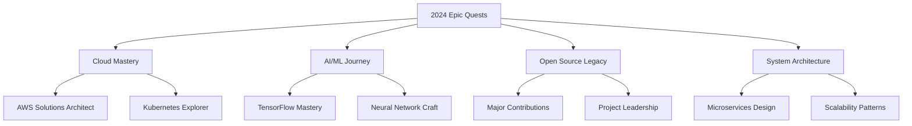

<div align="center">
  
</div>

<div align="center">
  <a href="https://git.io/typing-svg">
    
  </a>
</div>

<div align="center">
  
  
  
</div>

<br>

<table align="center">
  <tr>
    <td>
      <h2>🧙‍♂️ Wizardry & Craft</h2>
      
```typescript
class AjmalShaikh extends Developer {
    readonly name = "Ajmal Shaikh";
    readonly title = "Full Stack Sorcerer";
    
    get location() {
        return "Digital Realm 🌍";
    }
    
    get skills() {
        return {
            languages: ["JavaScript", "Python", "TypeScript"],
            frameworks: ["React", "Node.js", "Django"],
            databases: ["MongoDB", "PostgreSQL"],
            clouds: ["AWS", "Digital Ocean"],
            tools: ["Docker", "Git", "VS Code"],
            architecture: ["Microservices", "REST APIs"]
        };
    }
    
    get currentQuest() {
        return "Transforming Ideas into Digital Reality";
    }
    
    get dailyRoutine() {
        return [
            "☕ Coffee Powered Coding",
            "🔮 Problem Solving",
            "📚 Continuous Learning",
            "🎮 Gaming Breaks",
            "🎧 Coding with Music"
        ];
    }
}
```
    </td>
    <td>
      
    </td>
  </tr>
</table>

## 🛠️ Tech Arsenal & Enchantments

<div align="center">
  
### 🎭 Frontend Sorcery


### 🏰 Backend Fortification


### 🗄️ Data Vaults


### ⚔️ Battle-Tested Tools


</div>

## 📊 Magical Stats & Achievements

<div align="center">
  
  
</div>

## 🏆 Legendary Projects

<div align="center">
  <a href="https://github.com/Ajmal2727/SES24">
    
  </a>
  <a href="https://web-ajmal-portfolio.netlify.app/">
    
  </a>
</div>

## 🎯 Quest Log (2024)

<div align="center">
  

</div>

## 🤝 Guild Connections

<div align="center">
  <a href="mailto:ajmal.shaikh2727@gmail.com">
    
  </a>
  <a href="https://linkedin.com/in/ajmal-shk">
    
  </a>
  <a href="https://twitter.com/ajmal_shaikh">
    
  </a>
  <a href="https://web-ajmal-portfolio.netlify.app/">
    
  </a>
</div>

<div align="center">
  <h3>🌟 Daily Inspiration</h3>
  
</div>

<div align="center">
  <h3>🐍 Contribution Garden</h3>
  
</div>

<div align="center">
  
</div>
