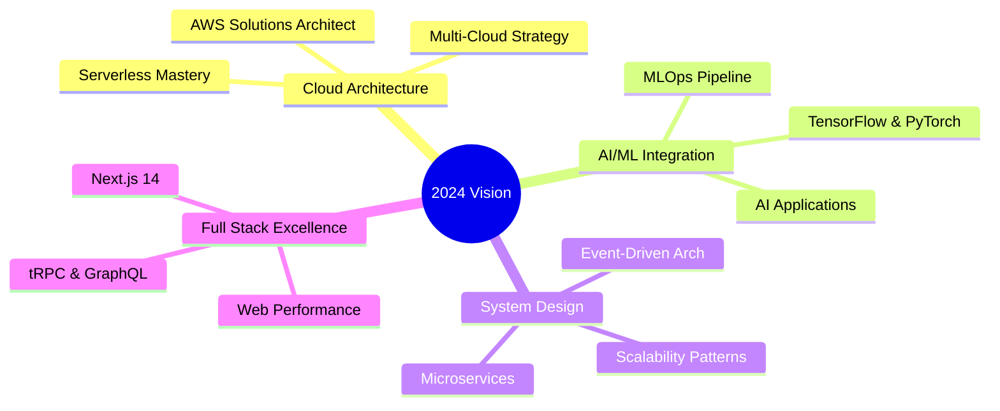

<div align="center">
  
</div>

<div align="center">
  
  <br/>
  
</div>

<br/>

<div align="center">
  <a href="https://github.com/Ajmal2727?tab=followers">
    
  </a>
  <a href="https://github.com/Ajmal2727?tab=repositories&sort=stargazers">
    
  </a>
  
</div>

<br/>

<details open>
<summary><h2>🧙‍♂️ The Developer's Chronicle</h2></summary>
<div align="center">
  <table>
    <tr>
      <td>
        
```typescript
export default class TechWizard {
    readonly identity = {
        name: "Ajmal Shaikh",
        title: "Full Stack Architect",
        location: "Digital Cosmos 🌌",
        timezone: "GMT+5:30"
    };

    readonly expertise = {
        frontend: {
            modern: ["React", "Next.js", "Vue 3"],
            styling: ["Tailwind", "Styled Components"],
            state: ["Redux", "Zustand", "Jotai"]
        },
        backend: {
            runtime: ["Node.js", "Bun", "Python"],
            frameworks: ["Express", "NestJS", "FastAPI"],
            databases: ["PostgreSQL", "MongoDB", "Redis"]
        },
        devops: {
            cloud: ["AWS", "GCP", "Digital Ocean"],
            containers: ["Docker", "Kubernetes"],
            cicd: ["GitHub Actions", "Jenkins"]
        }
    };

    readonly passions = [
        "🎨 Crafting Beautiful UIs",
        "🏗️ Building Scalable Systems",
        "🤖 Exploring AI/ML",
        "🌐 Contributing to Open Source"
    ];

    readonly currentQuests = [
        "Mastering System Design",
        "Cloud Architecture",
        "Web3 Development",
        "AI Integration"
    ];
}
```

</td>
<td>
  <div align="center">
    
    <br/><br/>
    
  </div>
</td>
    </tr>
  </table>
</div>
</details>

<details open>
<summary><h2>⚡ Tech Arsenal</h2></summary>
<div align="center">

### 🎨 Frontend Mastery
[](https://skillicons.dev)

### 🏗️ Backend Fortress
[](https://skillicons.dev)

### ☁️ Cloud & DevOps
[](https://skillicons.dev)

### 🛠️ Tools & Platforms
[](https://skillicons.dev)

</div>
</details>

<details open>
<summary><h2>📊 Contribution Metrics</h2></summary>
<div align="center">
  
  
</div>

<div align="center">
  
</div>
</details>

<details open>
<summary><h2>🏆 Featured Expeditions</h2></summary>
<div align="center">
  <a href="https://github.com/Ajmal2727/SES24">
    
  </a>
  <a href="https://web-ajmal-portfolio.netlify.app/">
    
  </a>
</div>
</details>

<details open>
<summary><h2>🎯 2024 Roadmap</h2></summary>
<div align="center">



</div>
</details>

<details open>
<summary><h2>🤝 Connect & Collaborate</h2></summary>
<div align="center">
  <a href="mailto:ajmal.shaikh2727@gmail.com">
    
  </a>
  <a href="https://linkedin.com/in/ajmal-shk">
    
  </a>
  <a href="https://twitter.com/ajmal_shaikh">
    
  </a>
  <a href="https://web-ajmal-portfolio.netlify.app/">
    
  </a>
</div>

<div align="center">
  <h3>💭 Tech Wisdom</h3>
  
</div>
</details>

<div align="center">
  
  
  
</div>
