<div align="center">
  
</div>

<div align="center">
  <a href="https://git.io/typing-svg"></a>
</div>

<div align="center">
  <a href="https://github.com/Ajmal2727?tab=followers">
    
  </a>
  
  
</div>

<br>

## 🧬 Digital DNA

<table align="center">
<tr>
<td width="60%">

```typescript
interface TechStack {
    languages: string[];
    frameworks: string[];
    databases: string[];
    cloud: string[];
}

class DigitalArchitect {
    private readonly identity = {
        name: "Ajmal Shaikh",
        role: "Full Stack Engineer",
        location: "Digital Nexus 🌐",
        website: "web-ajmal-portfolio.netlify.app"
    };

    private readonly stack: TechStack = {
        languages: [
            "TypeScript", "JavaScript",
            "Python", "Go", "Rust"
        ],
        frameworks: [
            "Next.js", "React", "Vue",
            "Node.js", "Express", "FastAPI"
        ],
        databases: [
            "PostgreSQL", "MongoDB",
            "Redis", "Cassandra"
        ],
        cloud: [
            "AWS", "GCP", "Azure",
            "Vercel", "Docker", "K8s"
        ]
    };

    public getCurrentFocus(): string[] {
        return [
            "🎯 System Architecture",
            "🚀 Cloud Native Apps",
            "🤖 AI/ML Integration",
            "⚡ Performance Optimization"
        ];
    }

    public getPhilosophy(): string {
        return "Code is poetry, architecture is art";
    }
}
```

</td>
<td>

<div align="center">
  
</div>

</td>
</tr>
</table>

## 🎨 Creative Arsenal

<div align="center">
  
</div>

## 📊 Performance Metrics

<div align="center">
  
  
</div>

<br>

<div align="center">
  
  
</div>

## 🎯 Mission Objectives 2024

<div align="center">



</div>

```mermaid
graph TB
    A[Mission 2024] --> B[Tech Mastery]
    A --> C[Innovation]
    A --> D[Leadership]
    A --> E[Community]

    B --> B1[Cloud Architecture]
    B --> B2[AI/ML Integration]
    B --> B3[Web3 Development]

    C --> C1[Novel Solutions]
    C --> C2[Performance Optimization]
    C --> C3[Security Enhancement]

    D --> D1[Team Leadership]
    D --> D2[Mentorship]
    D --> D3[Tech Talks]

    E --> E1[Open Source]
    E --> E2[Tech Writing]
    E --> E3[Community Building]

    style A fill:#00FFB3,stroke:#fff
    style B,C,D,E fill:#0D1117,stroke:#00FFB3
    style B1,B2,B3,C1,C2,C3,D1,D2,D3,E1,E2,E3 fill:#0D1117,stroke:#00FFB3
```

## 🚀 Featured Innovations

<div align="center">
  <a href="https://github.com/Ajmal2727/SES24">
    
  </a>
  <a href="https://web-ajmal-portfolio.netlify.app/">
    
  </a>
</div>

## 🌐 Digital Presence

<div align="center">
  <a href="mailto:ajmal.shaikh2727@gmail.com">
    
  </a>
  <a href="https://linkedin.com/in/ajmal-shk">
    
  </a>
  <a href="https://twitter.com/ajmal_shaikh">
    
  </a>
  <a href="https://web-ajmal-portfolio.netlify.app/">
    
  </a>
</div>

<div align="center">
  <h3>💭 Tech Philosophy</h3>
  
</div>

<div align="center">
  
</div>

<div align="center">
  
</div>

<!-- 
  Easter Egg: 
  "In the realm of code, creativity knows no bounds.
  Every line written is a step towards innovation."
-->
