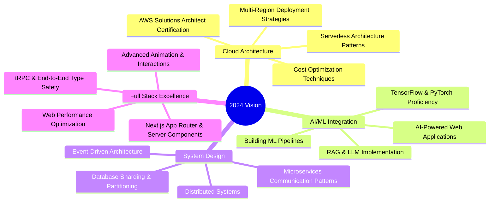

<!-- HEADER SECTION -->
<div align="center">
  
</div>

<!-- ANIMATED INTRO -->
<div align="center">
  
  <br/>
  
</div>

<br/>

<!-- BADGES SECTION WITH ENHANCED DESIGN -->
<div align="center">
  <a href="https://github.com/Ajmal2727?tab=followers">
    
  </a>
  <a href="https://github.com/Ajmal2727?tab=repositories&sort=stargazers">
    
  </a>
  
</div>

<br/>

<!-- ABOUT ME SECTION WITH CODE SNIPPET - MODERNIZED -->
<details open>
<summary><h2>🧙‍♂️ About Me | The Developer's Chronicle</h2></summary>
<div align="center">
  <table border="0" cellspacing="0" cellpadding="0">
    <tr>
      <td>
        
```typescript
class SoftwareArchitect {
    readonly identity = {
        name: "Ajmal Shaikh",
        title: "Full Stack Architect",
        location: "Digital Cosmos 🌌",
        timezone: "GMT+5:30"
    };

    readonly expertise = {
        frontend: {
            frameworks: ["React", "Next.js", "Vue 3"],
            styling: ["Tailwind", "Styled Components", "Framer Motion"],
            state: ["Redux", "Zustand", "TanStack Query"]
        },
        backend: {
            languages: ["Node.js", "TypeScript", "Python", "Go"],
            frameworks: ["Express", "NestJS", "FastAPI", "tRPC"],
            databases: ["PostgreSQL", "MongoDB", "Redis", "Supabase"]
        },
        devops: {
            cloud: ["AWS", "GCP", "Vercel", "Railway"],
            infrastructure: ["Docker", "Kubernetes", "Terraform"],
            cicd: ["GitHub Actions", "CircleCI", "ArgoCD"]
        },
        emerging: ["AI Integration", "Edge Computing", "Web3"]
    };

    readonly philosophy = [
        "Clean Architecture", 
        "Performance Optimization",
        "Developer Experience", 
        "User-Centric Design"
    ];

    readonly currentQuests = [
        "Advanced System Design Patterns",
        "Cloud-Native Architecture",
        "AI/ML Integration in Web Apps",
        "Web3 Development"
    ];
}
```

</td>
<td width="50%">
  <div align="center">
    
    <br/><br/>
    
  </div>
</td>
    </tr>
  </table>
</div>
</details>

<!-- TECH STACK SECTION - REORGANIZED -->
<details open>
<summary><h2>⚡ Tech Arsenal & Expertise</h2></summary>
<div align="center">

### 🎨 Frontend Ecosystem
[](https://skillicons.dev)

### 🎭 UI/UX Craftmanship
[](https://skillicons.dev)

### 🏗️ Backend Architecture
[](https://skillicons.dev)

### 💾 Database & Storage
[](https://skillicons.dev)

### ☁️ Cloud & DevOps
[](https://skillicons.dev)

### 🛠️ Tools & Platforms
[](https://skillicons.dev)

### 🔮 Exploring & Learning
[](https://skillicons.dev)

</div>
</details>

<!-- GITHUB STATS SECTION - ENHANCED VISUALS -->
<details open>
<summary><h2>📊 GitHub Analytics & Contributions</h2></summary>
<div align="center">
  
  
</div>

<div align="center">
  <a href="https://github.com/Ajmal2727">
    
  </a>
</div>

<!-- CUSTOM ANIMATED CONTRIBUTION SNAKE (FIXED VERSION) -->
<div align="center">
  <picture>
    <source media="(prefers-color-scheme: dark)" srcset="https://raw.githubusercontent.com/Ajmal2727/Ajmal2727/output/github-contribution-grid-snake-dark.svg">
    <source media="(prefers-color-scheme: light)" srcset="https://raw.githubusercontent.com/Ajmal2727/Ajmal2727/output/github-contribution-grid-snake.svg">
    
  </picture>
  
  <h4>⚠️ If the snake animation is not working, see the note about fixing it below ⚠️</h4>
</div>
</details>

<!-- FEATURED PROJECTS SECTION - IMPROVED LAYOUT -->
<details open>
<summary><h2>🏆 Featured Projects & Repositories</h2></summary>
<div align="center">
  <a href="https://github.com/Ajmal2727/SES24">
    
  </a>
  <a href="https://web-ajmal-portfolio.netlify.app/">
    
  </a>
</div>

<!-- ADD MORE PROJECTS WHEN AVAILABLE -->
<div align="center">
  <h3>More projects coming soon! 🚀</h3>
</div>
</details>

<!-- 2024 ROADMAP - ENHANCED MERMAID DIAGRAM -->
<details open>
<summary><h2>🎯 2024 Technical Roadmap</h2></summary>
<div align="center">



</div>
</details>

<!-- CONTACT SECTION - MODERNIZED -->
<details open>
<summary><h2>🤝 Connect & Collaborate</h2></summary>
<div align="center">
  <a href="mailto:ajmal.shaikh2727@gmail.com">
    
  </a>
  <a href="https://linkedin.com/in/ajmal-shk">
    
  </a>
  <a href="https://twitter.com/ajmal_shaikh">
    
  </a>
  <a href="https://web-ajmal-portfolio.netlify.app/">
    
  </a>
</div>

<!-- INSPIRATIONAL QUOTE -->
<div align="center">
  <h3>💭 Engineering Wisdom</h3>
  
</div>
</details>

<!-- FOOTER SECTION -->
<div align="center">
  
</div>
