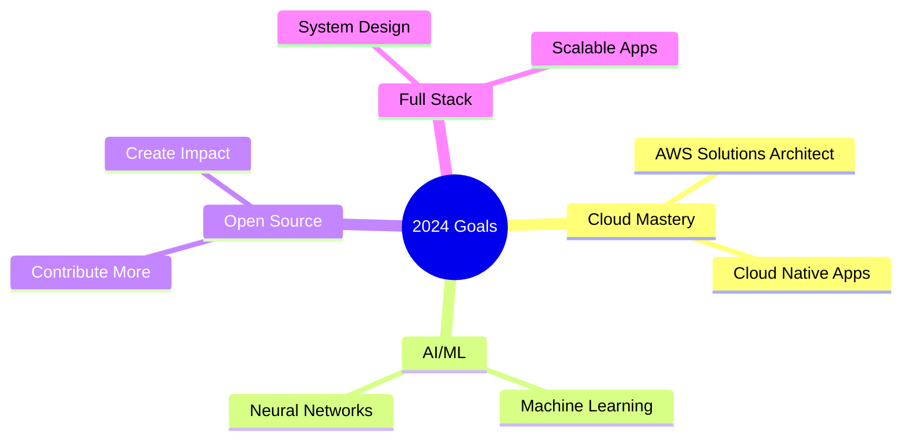

<h1 align="center">
   
  Welcome to Ajmal Shaikh's Profile!
</h1>

<div align="center">
  
</div>

<div align="center">
  
</div>

## 🌟 About Me

```typescript
const ajmalShaikh = {
    location: "Your Location 🌍",
    currentFocus: "Building amazing web experiences ⚡",
    funFact: "I debug with coffee ☕",
    dailyLife: ["💻 Coding", "📚 Learning", "🎮 Gaming", "🎧 Music"],
    motto: "Transform coffee into code 🚀"
};
```

## 🛠️ Technology Arsenal

<div align="center">
  
### Frontend


### Backend


### Tools & Platform


</div>

## 📊 GitHub Analytics

<div align="center">
  
  
</div>

<div align="center">
  
</div>

## 🏆 Featured Projects

<div align="center">

[](https://github.com/ajmal-shaikh/your-repo-name)
[](https://github.com/ajmal-shaikh/another-repo)

</div>

## 🎯 Current Goals



## 🤝 Connect With Me

<div align="center">
  
[](mailto:your.email@gmail.com)
[](https://linkedin.com/in/ajmal-shaikh)
[](https://twitter.com/ajmal_shaikh)
[](https://your-portfolio.com)

</div>

<div align="center">

### 💭 Quote of the Day
  
[](https://github.com/piyushsuthar/github-readme-quotes)

</div>

---

<div align="center">
  
</div>

<h3 align="center">❤️ Thank you for visiting my profile! 🙏</h3>
